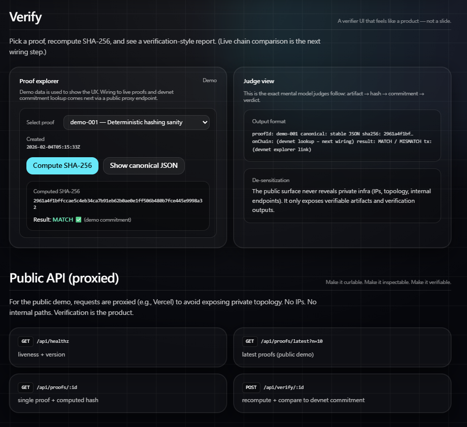

# TRACE ProofFeed (Solana Agent Hackathon)

**Verifiable Agent Reasoning (Solana Devnet) — Commit → Reveal → Verify**

TRACE ProofFeed turns an agent’s reasoning output into a **tamper-evident artifact**.

An agent run emits a **canonical JSON reasoning artifact**, we compute **SHA-256**, and **anchor the hash on Solana Devnet** (demo uses a Memo transaction).  
Anyone can later **recompute** and verify whether the published artifact is **MATCH / MISMATCH** against the on-chain anchor.

> This project does **not** judge whether reasoning is “correct”.  
> It proves whether a published reasoning artifact has been **altered after it was anchored**.

---

## Live Demo (Judges)

### On-chain Verify (Devnet Memo Anchor)
- Verify one proof against its Solana Devnet memo anchor:
  - https://trace-prooffeed.vercel.app/api/public/verify/demo-001

This returns:
- `computedSha256` (recomputed from the public canonicalArtifact)
- `onchain.txSig` + Explorer link (devnet)
- memo payload format: `trace_pf_v1|<proofId>|<sha256>`

> Tip: the public proof endpoints also include `txSig` + `explorer` for each demo proof.

### Public Verifier UI
- **Web:** https://trace-prooffeed.vercel.app

### Public API (No Auth)
> Judges should use the **public** endpoints below. No token required.

- **Health:** https://trace-prooffeed.vercel.app/api/healthz  
- **Latest proofs:** https://trace-prooffeed.vercel.app/api/public/proofs/latest?n=3  
- **Proof detail (example):** https://trace-prooffeed.vercel.app/api/public/proofs/demo-001  
- **On-chain verify (Memo anchor):** https://trace-prooffeed.vercel.app/api/public/verify/demo-001  

**One-liner (copy/paste)**
~~~bash
curl -s "https://trace-prooffeed.vercel.app/api/public/proofs/latest?n=3"
~~~

> Note: `/api/proofs/*` is a protected interface for private verifier access.  
> Public judging flow uses `/api/public/*`.

---

## Judge Quickstart (60 seconds)

1) Open the public UI  
   - https://trace-prooffeed.vercel.app

2) Fetch latest proofs (public)  
   - https://trace-prooffeed.vercel.app/api/public/proofs/latest?n=3

3) Open one proof (e.g. `demo-001`)  
   - https://trace-prooffeed.vercel.app/api/public/proofs/demo-001

4) Recompute & compare hash (artifact integrity)  
   - The proof contains a **canonicalArtifact** (deterministic string).
   - The verifier recomputes **sha256(canonicalArtifact)**.
   - Output is verification-style: **MATCH / MISMATCH**.

✅ If hashes match → **MATCH** (artifact unchanged)  
❌ If hashes differ → **MISMATCH** (artifact tampered / regenerated / modified)

5) Verify against Solana Devnet on-chain anchor (Memo)  
   - https://trace-prooffeed.vercel.app/api/public/verify/demo-001  
   - Returns:
     - `computedSha256` (from the public artifact)
     - `txSig` + Explorer link (devnet)
     - memo format: `trace_pf_v1|<proofId>|<sha256>`

---

## On-chain Anchors (Solana Devnet Memo)

For this hackathon demo, each proof is anchored with a Solana Devnet **Memo transaction** that contains:

`trace_pf_v1|<proofId>|<sha256(canonicalArtifact)>`

| proofId   | sha256 (computed) | devnet tx (explorer) |
|----------|--------------------|----------------------|
| demo-001 | d9a259b951387a8c7d65b973729fbf7e17cb16664089d49e7080afdf109a6157 | https://explorer.solana.com/tx/4jdRRSMozik3koDkKyPCQVb8Ez5Mbeja9fmAy8ubyW2KEYZxJcrWwq3zJYnsCW5Avrxya1XfwMSjA9nXCEAsMBmG?cluster=devnet |
| demo-002 | be135c346a54fdb048341d11282854a3e3e45689b0e320c3ec0ec328b1f7e138 | https://explorer.solana.com/tx/2RFkv4oJ6J7oKo9fDGHjPrcztduY6hbJENDMDiPtRJPTM5yLyLgpidBgkwQXuAaT5KrgKDq1GuWEmTMhpzZeUUXZ?cluster=devnet |
| demo-003 | 69ca7249a749a8ff8e92e18424125eae94288e98d9402c7a084d127f45710ab4 | https://explorer.solana.com/tx/21wzkQF1yEMx3qRtoc25SoJUyNVbxw6wKst2rG7y5FpCij6494irB8e6oMe4MdYz1UMgnPBFdFDqBUkzAj6q1UEn?cluster=devnet |

---

## Why This Matters

Agents are increasingly used in high-impact contexts (trading, security, governance).  
But today, most “agent logs” are **mutable**: they can be rewritten, summarized differently, or regenerated after the fact.

TRACE ProofFeed introduces **cryptographic accountability for reasoning**:

- **Verifiable**: anyone can recompute the same hash from the same canonical artifact.
- **Auditable**: anchors are immutable and timestamped on-chain (devnet for demo).
- **Composable**: other systems can build dispute resolution / reputation / governance auditing on top.

---

## Core Idea

> **Reasoning Artifact → SHA-256 → On-chain Anchor → Independent Verification**

We treat reasoning as a **data artifact** that can be cryptographically anchored, similar to how we anchor other integrity-critical data.

---

## Public Demo Model (De-sensitized / Proxied)

The public surface is designed to **avoid leaking private infrastructure**:
- no internal IPs
- no topology labels
- no privileged endpoints

For hackathon judging, the web deployment provides a **public, no-auth** feed:
- canonical artifacts
- computed hashes
- public verify endpoint returning on-chain memo anchor details

---

## Architecture Overview

1) **Artifact Producer (Agent / Runner)**
   - Produces a reasoning artifact (canonical JSON)
   - Deterministic serialization ensures stable hashing

2) **Commitment Layer (Solana Devnet)**
   - Demo uses a **Memo tx anchor** (stores `proofId + sha256` in memo payload)
   - (Optional next step) replace/extend with an Anchor program registry

3) **ProofFeed / Verifier API (Web)**
   - Serves demo proofs publicly (`/api/public/proofs/*`)
   - Verifies against on-chain memo anchor (`/api/public/verify/:id`)

4) **Verifier UI**
   - Shows proof selection + computed hash
   - Links to on-chain anchor (devnet explorer)

---

## Repository Structure

- `program/` — (optional) Anchor program / commitment registry (future wiring)
- `agent/` — agent-side artifact generation + commit logic (future wiring)
- `web/` — public UI + API routes (Vercel deploy)
- `web/scripts/` — demo memo anchor scripts (devnet)
- `docs/verify.png` — README screenshot

---

## Local Development (web)

~~~bash
cd web
npm ci
npm run dev
~~~

Then open:
- http://localhost:3000
- http://localhost:3000/api/healthz
- http://localhost:3000/api/public/proofs/latest?n=3
- http://localhost:3000/api/public/proofs/demo-001
- http://localhost:3000/api/public/verify/demo-001

---

## Links

- Repo: https://github.com/TRACE-CChain-Labs/trace-prooffeed-solana-agent
- Live UI: https://trace-prooffeed.vercel.app
